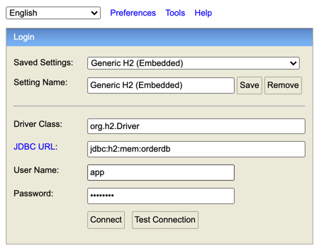
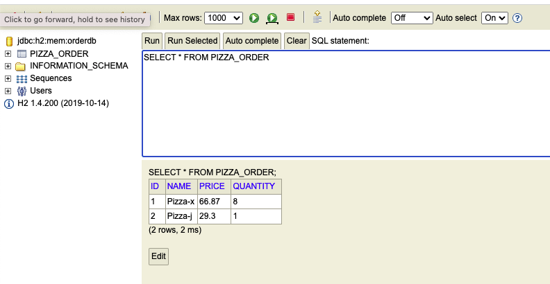

# pizza-joint-services

A prototype of the backend for pizza joint ordering backend system.

***This project is under development, please do not use for production use

# Description
Two services are involved in the project:
* Order generation service (Exposed port:80)
    * Generate a random pizza order and invoke order persistence service on service start
    * Provide an HTTP POST api on url `/order` for invoking order persistence service to save the generated order with following Http response code
        *  201 created: Order is successfully created
        *  4xx bad request: user input is invalid, order have not been created
* Order persistence service (Exposed port:81)
    * Provide an HTTP POST api on url `/order` to receive new order and store into embedded H2 database(as follow diagram)
        * request `application/json` payload format: `{
              "name":string,
              "quantity": integer,
              "price": double
              }`
            * eg. `{
              "name":"Pizza A",
              "quantity": 2,
              "price": 50
              }`
        *  201 created: Order is successfully created
        *  4xx bad request: user input is invalid, order have not been created

* This is the sample result in H2 database, you may login to embedded H2 database through url `http://localhost:81/h2-console/` with JDBC URL `jdbc:h2:mem:orderdb`,default account `app` and password `password`

# Prerequisite
* jdk 11 with gradle tool installed 
* docker installed

# How to Start
Go to this project root folder and execute `./buildAndRun.sh` 

This script will help doing the following steps
* compile order generation service
* build order generation service image
* compile order persistence service
* build order persistence service image
* start both services

# Design
